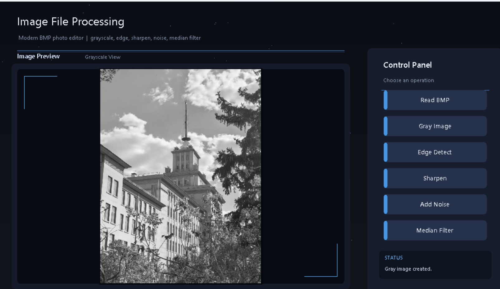
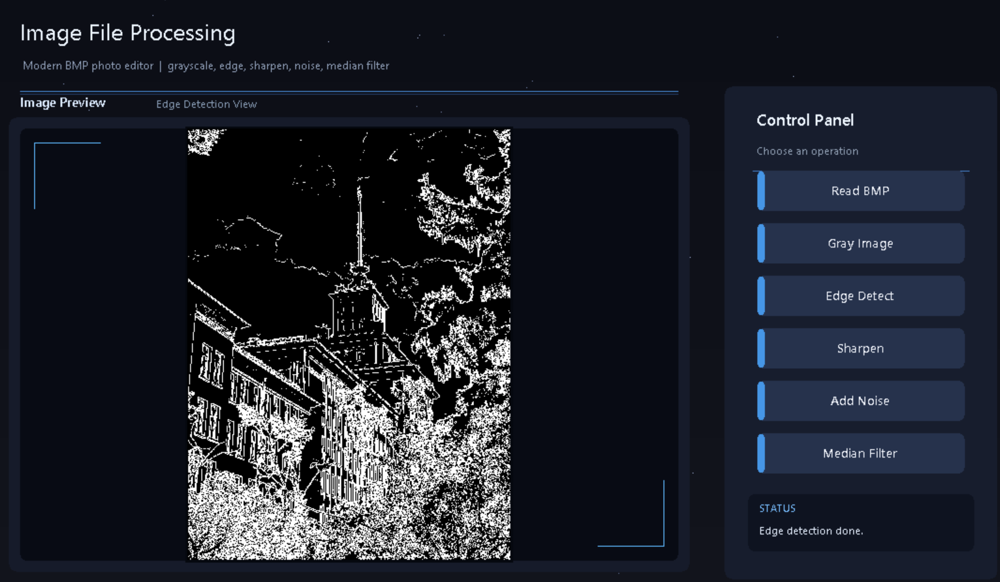
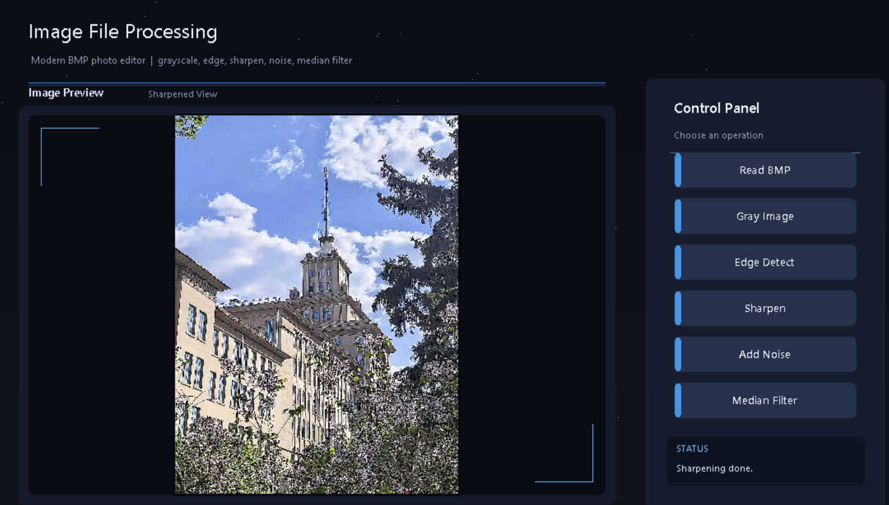
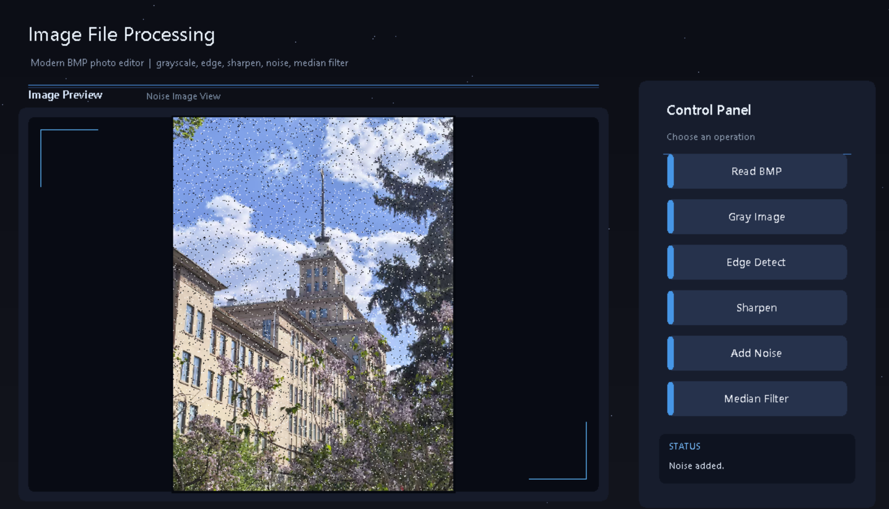

# Comprehensive Practice Project Report

# ImageFileProcessing System

**C/C++ BMP Image Processing with EasyX GUI**

| Item | Information |
|---|---|
| Course | Computing and Intelligent Programming |
| Project Type | Comprehensive Practice |
| Project Title | ImageFileProcessing |
| Student Name | HANAN OSSAMA |
| Student ID | 2025130323 |
| Semester | Spring Semester, 2026 |
| Lab Type | Comprehensive Design |
| Programming Language | C/C++ |
| IDE / Library | Visual Studio / EasyX |
| Operating System | Windows |
| Input Image Format | 24-bit BMP |

**Final Submission-Ready Report**  
**Report Completion Date:** June 19, 2026

---

# Abstract

This comprehensive practice project presents the design and implementation of an image-processing system named **ImageFileProcessing**. The system was developed using **C/C++** in **Visual Studio** with the **EasyX graphics library**. The main purpose of the project is to read, display, process, and save **24-bit BMP images** through a graphical user interface.

The program supports six main operations: reading a BMP image, converting the image to grayscale, performing Sobel edge detection, sharpening the image, adding salt-and-pepper noise, and removing noise using median filtering. Each operation can be selected through a button in the graphical interface. The processed image is displayed in the preview area and saved as a BMP output file.

In addition to implementing image-processing algorithms, the project focuses on modular programming, file processing, memory management, image data representation, user interface design, and debugging. The final interface uses a modern dark photo-editor style with a subtle futuristic and space-inspired visual design. It includes an image preview area, a right-side control panel, operation buttons, a status display area, and automatic image preview scaling so large images fit inside the program window.

Through this project, I improved my understanding of BMP file structure, BGR color order, row alignment, convolution-based image processing, EasyX GUI programming, and practical C/C++ development.

---

# 1. Objectives

The objective of this project is to build a complete C/C++ BMP image-processing program using the EasyX graphics library. The system reads and displays a 24-bit BMP image, applies several image-processing algorithms, saves the processing results, and provides a graphical interface for user interaction.

The main objectives are:

1. Understand the structure of 24-bit BMP image files, including BMP headers, pixel data, color storage order, and row alignment.
2. Implement file reading and saving functions for BMP images.
3. Convert a 24-bit color image into an 8-bit grayscale image.
4. Implement Sobel edge detection using 3x3 convolution kernels.
5. Sharpen an image using a 3x3 convolution kernel.
6. Add salt-and-pepper noise to an image and remove it using median filtering.
7. Design a user-friendly graphical interface using EasyX.
8. Apply modular programming to improve readability, maintainability, and reusability.
9. Improve debugging ability by solving file path, BMP validation, BGR order, row alignment, and scaling problems.

---

# 2. Development Environment

| Item | Description |
|---|---|
| Operating System | Windows |
| Programming Language | C/C++ |
| IDE | Visual Studio |
| External Library | EasyX |
| Image Format | 24-bit BMP |
| Main Input File Path Used During Testing | `C:\CP3\test.bmp` |
| Output Files | `gray.bmp`, `edge.bmp`, `sharpen.bmp`, `noise.bmp`, `median.bmp` |

The EasyX library was used to create the graphical user interface, draw buttons, display image pixels, and manage mouse-click interaction. Visual Studio was used as the main development environment for writing, compiling, debugging, and running the program.

---

# 3. Lab Project Content

## 3.1 Required Project Content

The selected project is **ImageFileProcessing**. The program performs basic image-processing operations on a 24-bit BMP image. The following required functions were implemented:

1. Read a 24-bit BMP image.
2. Display the original BMP image.
3. Convert the image to grayscale.
4. Save the grayscale result as `gray.bmp`.
5. Perform Sobel edge detection.
6. Save the edge detection result as `edge.bmp`.
7. Sharpen the image using a 3x3 convolution kernel.
8. Save the sharpened result as `sharpen.bmp`.
9. Add salt-and-pepper noise.
10. Save the noisy image as `noise.bmp`.
11. Apply median filtering to reduce noise.
12. Save the filtered result as `median.bmp`.
13. Provide a graphical interface with buttons and an image preview area.

## 3.2 Main Program Buttons

The final program contains the following six main buttons:

```text
Read BMP
Gray Image
Edge Detect
Sharpen
Add Noise
Median Filter
```

---

# 4. Added or Improved Features

1. **Modern dark photo-editor style UI:** The final program interface was redesigned into a modern dark-style layout, making it more professional and easier to use.
2. **Subtle futuristic visual design:** The interface uses a dark dashboard style with a subtle space-inspired appearance.
3. **Automatic image preview scaling:** Large images can be scaled automatically through `showImage24Fit()` and `showImage8Fit()` so that they fit inside the preview area.
4. **Status display area:** The interface contains a status area that reports operation results, such as whether the image was loaded, processed, or saved successfully.
5. **Modular function design:** The program is divided into independent functions for reading, saving, processing, displaying, and UI drawing.
6. **Output BMP saving:** Every image-processing operation saves its result as a BMP file.
7. **Error checking:** The program checks file opening, BMP file type, bit depth, compression type, and memory allocation.

---

# 5. System Functional Design and Program Implementation

The ImageFileProcessing system is designed as an interactive graphical image-processing application. The user interacts with the system by clicking buttons in the EasyX window. Each button calls a specific image-processing function. The system displays the result in the preview area, saves the output BMP file, and updates the status display area.

The main implementation idea is to separate image-processing algorithms from UI drawing. For example, the Sobel edge detection function does not draw buttons, and the UI drawing function does not perform image convolution. This separation improves program organization and makes the code easier to maintain.

## 5.1 General Program Workflow

```text
Start program
↓
Initialize EasyX window
↓
Draw graphical user interface
↓
Wait for mouse click
↓
Check selected button
↓
Call corresponding image-processing function
↓
Display processed image in preview area
↓
Save output BMP file
↓
Update status display area
↓
Continue waiting for user operation
```

## 5.2 Final UI Screenshot

The final interface follows a modern dark photo-editor layout with a preview area, control panel, operation buttons, and status display area.

<p align="center">
  
</p>

*Figure 7. Final modern user interface.*

---

# 6. System Functional Module Decomposition

The system is divided into nine main modules. Each module is responsible for a clear part of the program. This top-down decomposition improves readability, maintainability, and reusability.

1. GUI module
2. BMP file reading module
3. BMP file saving module
4. Grayscale conversion module
5. Sobel edge detection module
6. Image sharpening module
7. Salt-and-pepper noise module
8. Median filtering module
9. Image display scaling module

## 6.1 System Module Diagram

```text
ImageFileProcessing System
│
├── GUI Module
│   ├── Draw background
│   ├── Draw title
│   ├── Draw preview area
│   ├── Draw control panel
│   ├── Draw buttons
│   └── Handle mouse clicks
│
├── BMP File Module
│   ├── read_bmp()
│   ├── save_bmp_8bit()
│   └── save_bmp_24bit()
│
├── Image Processing Module
│   ├── convert_24bit_to_gray()
│   ├── edge_detection()
│   ├── image_sharpening()
│   ├── addSaltPepperNoise()
│   └── medianFiltering()
│
└── Display Module
    ├── showImage24Fit()
    └── showImage8Fit()
```

## 6.2 Module Descriptions

**GUI Module:** Draws the background, title, preview frame, control panel, buttons, and status display area. It also handles mouse clicks and determines which operation the user selected.

**BMP File Reading Module:** Opens the BMP image file in binary mode, reads the file header and information header, validates the image format, calculates row stride, allocates memory, and reads pixel data.

**BMP File Saving Module:** Saves processed image data into BMP files. It supports both 8-bit grayscale BMP images and 24-bit color BMP images.

**Grayscale Conversion Module:** Converts the original 24-bit BGR image into an 8-bit grayscale image using the weighted grayscale formula.

**Sobel Edge Detection Module:** Detects image contours on the grayscale image using Sobel horizontal and vertical convolution kernels.

**Image Sharpening Module:** Sharpens the image using a 3x3 convolution kernel by strengthening the center pixel and subtracting surrounding pixels.

**Salt-and-Pepper Noise Module:** Randomly changes selected pixels to black or white to simulate salt-and-pepper noise.

**Median Filtering Module:** Removes salt-and-pepper noise using a 3x3 median filter.

**Image Display Scaling Module:** Displays large images inside the preview area by automatically scaling them while preserving the image aspect ratio.

---

# 7. Function Specifications and Interface Design

| No. | Function Name | Function Description | Parameters | Return Value |
|---:|---|---|---|---|
| 1 | `calculate_stride()` | Calculates the number of bytes in each BMP row after 4-byte alignment. | `int width`, `int bit_count` | `int` row stride |
| 2 | `read_bmp()` | Reads a 24-bit BMP file, validates the format, and loads pixel data into memory. | File path, BMP headers, image buffer pointer | `bool` success/failure |
| 3 | `save_bmp_8bit()` | Saves an 8-bit grayscale image as a BMP file with a 256-level grayscale palette. | Output path, gray buffer, width, height | `bool` success/failure |
| 4 | `save_bmp_24bit()` | Saves a 24-bit color image as a BMP file. | Output path, color buffer, width, height | `bool` success/failure |
| 5 | `convert_24bit_to_gray()` | Converts a 24-bit BGR image into an 8-bit grayscale image. | Source buffer, gray buffer, width, height | `void` |
| 6 | `edge_detection()` | Performs Sobel edge detection on the grayscale image. | Gray buffer, edge buffer, width, height | `void` |
| 7 | `image_sharpening()` | Sharpens a color image using a 3x3 convolution kernel. | Source buffer, destination buffer, width, height | `void` |
| 8 | `addSaltPepperNoise()` | Adds random black and white pixels to simulate noise. | Source buffer, destination buffer, width, height, noise ratio | `void` |
| 9 | `medianFiltering()` | Removes noise using a 3x3 median filter. | Source buffer, destination buffer, width, height | `void` |
| 10 | `showImage24Fit()` | Displays a 24-bit color image scaled to fit the preview area. | Image buffer, width, height, preview area information | `void` |
| 11 | `showImage8Fit()` | Displays an 8-bit grayscale image scaled to fit the preview area. | Gray buffer, width, height, preview area information | `void` |
| 12 | `drawUI()` | Draws the full graphical interface. | UI state or status text | `void` |

## 7.1 Function Calling Relationship

```text
main()
│
├── Initialize EasyX window
├── drawUI()
│   ├── Draw background
│   ├── Draw title
│   ├── Draw preview area
│   ├── Draw control panel
│   ├── Draw buttons
│   └── Draw status display area
│
├── Mouse event loop
│   │
│   ├── Read BMP
│   │   ├── read_bmp()
│   │   └── showImage24Fit()
│   │
│   ├── Gray Image
│   │   ├── convert_24bit_to_gray()
│   │   ├── save_bmp_8bit()
│   │   └── showImage8Fit()
│   │
│   ├── Edge Detect
│   │   ├── edge_detection()
│   │   ├── save_bmp_8bit()
│   │   └── showImage8Fit()
│   │
│   ├── Sharpen
│   │   ├── image_sharpening()
│   │   ├── save_bmp_24bit()
│   │   └── showImage24Fit()
│   │
│   ├── Add Noise
│   │   ├── addSaltPepperNoise()
│   │   ├── save_bmp_24bit()
│   │   └── showImage24Fit()
│   │
│   └── Median Filter
│       ├── medianFiltering()
│       ├── save_bmp_24bit()
│       └── showImage24Fit()
│
└── Close EasyX window
```

---

# 8. Data Structure Design

## 8.1 `struct MyBITMAPFILEHEADER`

`MyBITMAPFILEHEADER` stores basic BMP file information. It identifies the file type and locates the pixel data.

```text
bfType      : Identifies the BMP file type. Correct BMP files use 0x4D42.
bfSize      : Total size of the BMP file.
bfReserved1 : Reserved field.
bfReserved2 : Reserved field.
bfOffBits   : Offset from the beginning of the file to the pixel data.
```

The field `bfType` is especially important because it is used to check whether the file is really a BMP file.

## 8.2 `struct MyBITMAPINFOHEADER`

`MyBITMAPINFOHEADER` stores detailed information about the image, including image width, height, bit depth, compression type, and pixel data size.

```text
biSize          : Size of the information header.
biWidth         : Image width in pixels.
biHeight        : Image height in pixels.
biPlanes        : Number of color planes.
biBitCount      : Number of bits per pixel.
biCompression   : Compression type.
biSizeImage     : Size of image data.
biXPelsPerMeter : Horizontal resolution.
biYPelsPerMeter : Vertical resolution.
biClrUsed       : Number of colors used.
biClrImportant  : Number of important colors.
```

In this project, the program checks whether `biBitCount` is 24 and whether `biCompression` is 0. This ensures that the input file is a 24-bit uncompressed BMP image.

## 8.3 `struct MyRGBQUAD`

`MyRGBQUAD` is used for the color palette of 8-bit grayscale BMP images. A grayscale BMP file needs a palette containing 256 gray levels.

Each palette entry contains:

```text
rgbBlue     : Blue component.
rgbGreen    : Green component.
rgbRed      : Red component.
rgbReserved : Reserved field.
```

For grayscale images, the red, green, and blue values are the same.

## 8.4 `struct Button`

The `Button` structure is used to represent buttons in the graphical interface.

```text
x, y     : Button position.
width    : Button width.
height   : Button height.
text     : Button label.
```

Using a `Button` structure makes the UI easier to manage because all buttons can be stored in an array and checked during mouse click events.

## 8.5 Image Buffers

The program uses `unsigned char*` buffers to store pixel data dynamically.

| Buffer | Purpose |
|---|---|
| `imageData` | Stores the original 24-bit BMP image data. |
| `grayData` | Stores the 8-bit grayscale image data. |
| `edgeData` | Stores the Sobel edge detection result. |
| `sharpenData` | Stores the sharpened color image. |
| `noiseData` | Stores the image after adding salt-and-pepper noise. |
| `medianData` | Stores the image after median filtering. |

BMP images store pixels in **BGR order**, not RGB order. Therefore, when reading a pixel from a 24-bit BMP image, the order is:

```text
Blue, Green, Red
```

When displaying the pixel with EasyX, the program should use:

```cpp
RGB(R, G, B)
```

BMP image rows must also be aligned to 4 bytes. Therefore, the actual number of bytes in each row may be larger than `width * 3`.

```cpp
int calculate_stride(int width, int bit_count)
{
    return ((width * bit_count + 31) / 32) * 4;
}
```

---

# 9. Algorithm Design

## 9.1 BMP Reading Algorithm

The BMP reading algorithm is responsible for loading the image from disk into memory.

1. Open the file in binary mode.
2. Read the BMP file header.
3. Check whether `bfType == 0x4D42`.
4. Read the BMP information header.
5. Check whether the image is 24-bit.
6. Check whether the image is uncompressed.
7. Calculate row stride.
8. Allocate memory.
9. Read pixel data.
10. Display the image.

The purpose of validation is to prevent the program from reading unsupported or invalid files. For example, if the file is not a real BMP image or if it is compressed, the program should stop reading and show an error status.

## 9.2 Grayscale Conversion Algorithm

The grayscale conversion algorithm converts a 24-bit color image into an 8-bit grayscale image. The 24-bit BGR pixel is converted into one 8-bit grayscale value using the formula:

```text
Gray = 0.299R + 0.587G + 0.114B
```

This formula gives different weights to red, green, and blue because human vision is more sensitive to green light. The grayscale result is saved as `gray.bmp`. Because it is an 8-bit grayscale BMP file, a 256-level grayscale palette is used.

## 9.3 Sobel Edge Detection Algorithm

Sobel edge detection detects edges and contours in an image. The image is first converted to grayscale. Then two 3x3 kernels are used to calculate horizontal and vertical gradients.

```cpp
int sobel_x[3][3] = {
    {-1, 0, 1},
    {-2, 0, 2},
    {-1, 0, 1}
};

int sobel_y[3][3] = {
    {-1, -2, -1},
    { 0,  0,  0},
    { 1,  2,  1}
};
```

The algorithm calculates the horizontal gradient `Gx` and vertical gradient `Gy`. Then the gradient magnitude is calculated as:

```text
G = sqrt(Gx² + Gy²)
```

Finally, a threshold is applied:

```text
If G > threshold, output white edge pixel.
Otherwise, output black pixel.
```

This produces a binary edge image where the main contours are white and the background is black.

## 9.4 Image Sharpening Algorithm

Image sharpening enhances image details and edges. The project uses the following 3x3 sharpening kernel:

```cpp
int kernel[3][3] = {
    {-1, -1, -1},
    {-1,  9, -1},
    {-1, -1, -1}
};
```

The center pixel is multiplied by 9, while the surrounding pixels are subtracted. This increases local contrast and makes edges clearer. For color images, the B, G, and R channels are processed separately. After convolution, the result is limited to the range 0 to 255.

## 9.5 Salt-and-Pepper Noise Algorithm

Salt-and-pepper noise randomly changes some pixels into black or white.

```text
Black pixel = pepper noise
White pixel = salt noise
```

The algorithm traverses all pixels, generates a random number, and changes selected pixels to either black or white according to the noise probability.

## 9.6 Median Filtering Algorithm

Median filtering is effective for removing salt-and-pepper noise. The algorithm uses a 3x3 window:

1. Select the current pixel.
2. Collect the 9 neighboring pixel values in the 3x3 window.
3. Sort the 9 values.
4. Select the middle value.
5. Replace the center pixel with the median value.

For a color image, the B, G, and R channels are processed separately. Median filtering reduces random noise while preserving edges better than simple average filtering.

---

# 10. Problems Encountered During the Project and Their Solutions

## Problem 1: BMP file could not be opened

**Symptom:** The program failed to load the input image.

**Cause:** The file path was wrong, or the image was not placed in the expected folder.

**Solution:** I used the absolute path `C:\CP3\test.bmp`. Using an absolute path helped confirm the file location and avoid path confusion during testing.

## Problem 2: File was not a real BMP image

**Symptom:** The program detected that the file was invalid even though the file name ended with `.bmp`.

**Cause:** The image was renamed from JPG or PNG to BMP without real conversion. Changing the file extension does not change the actual image format.

**Solution:** I opened the image in Microsoft Paint and used **Save as -> BMP picture**. After saving it as a real BMP image, the program could read the file successfully.

## Problem 3: Image was too large for the EasyX window

**Symptom:** Only part of the image was visible in the preview area.

**Cause:** The original image size was larger than the EasyX window or preview frame.

**Solution:** I implemented `showImage24Fit()` and `showImage8Fit()`. These functions scale the image automatically so the full image fits inside the preview area.

## Problem 4: Wrong color display

**Symptom:** The image colors were incorrect. Red and blue appeared swapped.

**Cause:** BMP stores pixels in BGR order, not RGB order.

**Solution:** I read the pixel data as B, G, and R, then displayed it using `RGB(R, G, B)`.

## Problem 5: Row alignment problem

**Symptom:** The image appeared distorted, or some rows seemed shifted.

**Cause:** BMP rows are aligned to multiples of 4 bytes. Using only `width * 3` as the row size ignores padding bytes.

**Solution:** I used `calculate_stride()` to calculate the correct row size including padding.

## Problem 6: UI was not professional

**Symptom:** The first interface looked too simple and was not suitable for a polished project demonstration.

**Cause:** The early version focused mainly on algorithm implementation and used basic buttons and a simple background.

**Solution:** I redesigned the interface as a modern dark photo-editor style UI with a preview area, right-side control panel, operation buttons, status display area, and automatic preview scaling.

---

# 11. Test Cases and System Test Results

Testing was conducted after the program compiled and ran correctly. The testing method was functional testing. Each button was tested separately to check whether the corresponding function worked correctly, whether the image result was displayed, and whether the output BMP file was saved.

The following screenshots show the actual results obtained by running the final ImageFileProcessing program. Each operation was tested through the graphical interface, and the corresponding output file was generated successfully.

## Test Case 1: Read BMP

| Item | Description |
|---|---|
| Purpose | Verify the program can read and display the original BMP image. |
| Input | `C:\CP3\test.bmp` |
| Operation | Click the **Read BMP** button. |
| Expected Result | Original image appears in the preview area. |
| Output File | None |
| Result | Passed |

<p align="center">
  
</p>

*Figure 1. Original BMP image loaded in the program.*

## Test Case 2: Gray Image

| Item | Description |
|---|---|
| Purpose | Verify grayscale conversion. |
| Input | Loaded 24-bit BMP image. |
| Operation | Click the **Gray Image** button. |
| Expected Result | Image becomes grayscale and `gray.bmp` is saved. |
| Output File | `gray.bmp` |
| Result | Passed |

<p align="center">
  
</p>

*Figure 2. Grayscale conversion result.*

## Test Case 3: Edge Detect

| Item | Description |
|---|---|
| Purpose | Verify Sobel edge detection. |
| Input | Grayscale image data. |
| Operation | Click the **Edge Detect** button. |
| Expected Result | Main contours are extracted and `edge.bmp` is saved. |
| Output File | `edge.bmp` |
| Result | Passed |

<p align="center">
  
</p>

*Figure 3. Sobel edge detection result.*

## Test Case 4: Sharpen

| Item | Description |
|---|---|
| Purpose | Verify image sharpening. |
| Input | Loaded 24-bit BMP image. |
| Operation | Click the **Sharpen** button. |
| Expected Result | Image details become clearer and `sharpen.bmp` is saved. |
| Output File | `sharpen.bmp` |
| Result | Passed |

<p align="center">
  
</p>

*Figure 4. Image sharpening result.*

## Test Case 5: Add Noise

| Item | Description |
|---|---|
| Purpose | Verify salt-and-pepper noise generation. |
| Input | Loaded 24-bit BMP image. |
| Operation | Click the **Add Noise** button. |
| Expected Result | Random black and white noise appears and `noise.bmp` is saved. |
| Output File | `noise.bmp` |
| Result | Passed |

<p align="center">
  
</p>

*Figure 5. Salt-and-pepper noise result.*

## Test Case 6: Median Filter

| Item | Description |
|---|---|
| Purpose | Verify median filtering. |
| Input | Image with salt-and-pepper noise. |
| Operation | Click the **Median Filter** button. |
| Expected Result | Noise is reduced and `median.bmp` is saved. |
| Output File | `median.bmp` |
| Result | Passed |

<p align="center">
  
</p>

*Figure 6. Median filtering result.*

---

# 12. Program Core Code

The following snippets show the key implementation logic. The complete source code is included in the `SourceCode` folder.

## 12.1 Row Stride Calculation

```cpp
int calculate_stride(int width, int bit_count)
{
    // BMP rows are aligned to 4-byte boundaries.
    return ((width * bit_count + 31) / 32) * 4;
}
```

## 12.2 BMP Validation in `read_bmp()`

```cpp
bool read_bmp(const char* filename)
{
    FILE* fp = fopen(filename, "rb");
    if (fp == NULL)
    {
        // File cannot be opened.
        return false;
    }

    fread(&fileHeader, sizeof(MyBITMAPFILEHEADER), 1, fp);

    // Check BMP signature. 0x4D42 means 'BM'.
    if (fileHeader.bfType != 0x4D42)
    {
        fclose(fp);
        return false;
    }

    fread(&infoHeader, sizeof(MyBITMAPINFOHEADER), 1, fp);

    // Only 24-bit uncompressed BMP images are supported.
    if (infoHeader.biBitCount != 24 || infoHeader.biCompression != 0)
    {
        fclose(fp);
        return false;
    }

    int width = infoHeader.biWidth;
    int height = abs(infoHeader.biHeight);
    int stride = calculate_stride(width, 24);

    imageData = new unsigned char[stride * height];
    if (imageData == NULL)
    {
        fclose(fp);
        return false;
    }

    fseek(fp, fileHeader.bfOffBits, SEEK_SET);
    fread(imageData, 1, stride * height, fp);

    fclose(fp);
    return true;
}
```

## 12.3 Grayscale Conversion

```cpp
void convert_24bit_to_gray(unsigned char* src,
                           unsigned char* gray,
                           int width,
                           int height)
{
    int stride = calculate_stride(width, 24);

    for (int y = 0; y < height; y++)
    {
        for (int x = 0; x < width; x++)
        {
            int index = y * stride + x * 3;

            // BMP stores pixels in BGR order.
            unsigned char B = src[index];
            unsigned char G = src[index + 1];
            unsigned char R = src[index + 2];

            // Weighted grayscale formula.
            gray[y * width + x] =
                (unsigned char)(0.299 * R + 0.587 * G + 0.114 * B);
        }
    }
}
```

## 12.4 Sobel Edge Detection

```cpp
void edge_detection(unsigned char* gray,
                    unsigned char* edge,
                    int width,
                    int height)
{
    int sobel_x[3][3] = {
        {-1, 0, 1},
        {-2, 0, 2},
        {-1, 0, 1}
    };

    int sobel_y[3][3] = {
        {-1, -2, -1},
        { 0,  0,  0},
        { 1,  2,  1}
    };

    int threshold = 100;

    for (int y = 1; y < height - 1; y++)
    {
        for (int x = 1; x < width - 1; x++)
        {
            int gx = 0;
            int gy = 0;

            // 3x3 convolution.
            for (int j = -1; j <= 1; j++)
            {
                for (int i = -1; i <= 1; i++)
                {
                    int pixel = gray[(y + j) * width + (x + i)];
                    gx += pixel * sobel_x[j + 1][i + 1];
                    gy += pixel * sobel_y[j + 1][i + 1];
                }
            }

            int magnitude = (int)sqrt((double)(gx * gx + gy * gy));
            edge[y * width + x] = (magnitude > threshold) ? 255 : 0;
        }
    }
}
```

## 12.5 Image Sharpening

```cpp
void image_sharpening(unsigned char* src,
                      unsigned char* dst,
                      int width,
                      int height)
{
    int kernel[3][3] = {
        {-1, -1, -1},
        {-1,  9, -1},
        {-1, -1, -1}
    };

    int stride = calculate_stride(width, 24);

    for (int y = 1; y < height - 1; y++)
    {
        for (int x = 1; x < width - 1; x++)
        {
            for (int c = 0; c < 3; c++)
            {
                int sum = 0;

                // Apply convolution to each BGR channel separately.
                for (int j = -1; j <= 1; j++)
                {
                    for (int i = -1; i <= 1; i++)
                    {
                        int index = (y + j) * stride + (x + i) * 3 + c;
                        sum += src[index] * kernel[j + 1][i + 1];
                    }
                }

                // Clamp result to 0-255.
                if (sum < 0) sum = 0;
                if (sum > 255) sum = 255;

                dst[y * stride + x * 3 + c] = (unsigned char)sum;
            }
        }
    }
}
```

## 12.6 Salt-and-Pepper Noise Logic

```cpp
void addSaltPepperNoise(unsigned char* src,
                        unsigned char* dst,
                        int width,
                        int height,
                        double noiseRatio)
{
    int stride = calculate_stride(width, 24);

    // Copy original image first.
    memcpy(dst, src, stride * height);

    for (int y = 0; y < height; y++)
    {
        for (int x = 0; x < width; x++)
        {
            double r = (double)rand() / RAND_MAX;

            if (r < noiseRatio)
            {
                int index = y * stride + x * 3;

                if (rand() % 2 == 0)
                {
                    // Pepper noise: black pixel.
                    dst[index] = 0;
                    dst[index + 1] = 0;
                    dst[index + 2] = 0;
                }
                else
                {
                    // Salt noise: white pixel.
                    dst[index] = 255;
                    dst[index + 1] = 255;
                    dst[index + 2] = 255;
                }
            }
        }
    }
}
```

## 12.7 Median Filtering Logic

```cpp
void medianFiltering(unsigned char* src,
                     unsigned char* dst,
                     int width,
                     int height)
{
    int stride = calculate_stride(width, 24);
    memcpy(dst, src, stride * height);

    for (int y = 1; y < height - 1; y++)
    {
        for (int x = 1; x < width - 1; x++)
        {
            for (int c = 0; c < 3; c++)
            {
                unsigned char values[9];
                int k = 0;

                // Collect 3x3 neighboring values.
                for (int j = -1; j <= 1; j++)
                {
                    for (int i = -1; i <= 1; i++)
                    {
                        int index = (y + j) * stride + (x + i) * 3 + c;
                        values[k++] = src[index];
                    }
                }

                // Sort the 9 values.
                for (int m = 0; m < 8; m++)
                {
                    for (int n = m + 1; n < 9; n++)
                    {
                        if (values[m] > values[n])
                        {
                            unsigned char temp = values[m];
                            values[m] = values[n];
                            values[n] = temp;
                        }
                    }
                }

                // Replace center pixel with median value.
                dst[y * stride + x * 3 + c] = values[4];
            }
        }
    }
}
```

## 12.8 Display Scaling Logic

```cpp
void showImage24Fit(unsigned char* img,
                    int width,
                    int height,
                    int previewX,
                    int previewY,
                    int previewW,
                    int previewH)
{
    double scaleX = (double)previewW / width;
    double scaleY = (double)previewH / height;

    // Use the smaller scale to keep the full image visible.
    double scale = scaleX < scaleY ? scaleX : scaleY;

    int displayW = (int)(width * scale);
    int displayH = (int)(height * scale);

    int startX = previewX + (previewW - displayW) / 2;
    int startY = previewY + (previewH - displayH) / 2;

    // Display pixels according to the scaled coordinates.
    // BMP data is read as BGR and displayed as RGB(R, G, B).
}
```

---

# 13. Analysis, Summary, and Reflections

## 13.1 Novel and Creative Aspects

1. Modern dark photo-editor UI.
2. Subtle futuristic visual design.
3. Integrated multiple image-processing algorithms.
4. Automatic image preview scaling.
5. Output saving for every operation.
6. Modular program structure.

## 13.2 Areas for Improvement

1. Add a file selection dialog instead of using a fixed file path.
2. Add adjustable Sobel threshold.
3. Add adjustable noise ratio.
4. Support more image formats, such as JPG and PNG.
5. Add a side-by-side before/after comparison view.
6. Improve processing speed for very large images.
7. Add undo and reset functions.
8. Add more image-processing operations, such as blur, brightness adjustment, and contrast adjustment.

## 13.3 Gains and Reflections

Through this project, I gained practical experience in C/C++ programming and image processing. I learned how BMP image files are structured and how image data is stored in memory. Before this project, I only had a basic understanding of images as visual files, but this project helped me understand that images are stored as pixel data with specific formats and rules.

One important concept I learned is that BMP images store color pixels in BGR order, not RGB order. This caused incorrect color display at first, but after analyzing the problem, I corrected the display by reading the data as B, G, and R, then using `RGB(R, G, B)` in EasyX.

I also learned about BMP row alignment. BMP rows must be aligned to 4 bytes, so the actual row size is not always equal to `width * 3`. This problem helped me understand why low-level file processing requires careful attention to data format details.

In terms of algorithms, I learned how grayscale conversion works using a weighted formula, how Sobel edge detection uses convolution kernels to calculate gradients, how sharpening enhances image details, how salt-and-pepper noise is generated, and how median filtering removes noise by replacing a pixel with the median value of its neighborhood.

This project also improved my GUI programming ability. By using EasyX, I practiced drawing a window, buttons, preview area, control panel, and status bar. I learned that a good program should not only implement correct algorithms but also provide a clear and friendly user interface.

During debugging, I solved several practical problems, including wrong file paths, invalid BMP files, incorrect color order, row alignment errors, large image display problems, and basic UI design issues. These problems improved my independent problem-solving ability.

Overall, this project helped me connect programming theory with practical system development. It also strengthened my understanding of modular programming, file processing, memory management, image-processing algorithms, and user interface design.

---

# 14. Self-Assessment

| Question | Yes | No |
|---|:---:|:---:|
| Was the program running without bugs? | Yes |  |
| Did you watch the instructional videos in the smart course before working on the project and writing the report? | Yes |  |
| Was the code compliant with coding standards, including indentation, alignment, and necessary comments? | Yes |  |
| Was modular design implemented? | Yes |  |
| Was AI-assisted tooling used? | Yes |  |

---

# 15. Final Message to the Instructor

Thank you for reviewing my project. Through this comprehensive practice project, I improved my understanding of C/C++ programming, BMP image file structure, pixel-level image processing algorithms, and EasyX graphical interface design. I will continue improving this project by adding more interactive features, adjustable parameters, and support for additional image formats.

---

# 16. Report Completion Date

**June 19, 2026**

---

# 17. Appendix

## 17.1 Final Submission Folder Structure

```text
HANANOSSAMA_2025130323_ImageFileProcessing/
|
+-- SourceCode/
|   +-- task1.cpp
|   +-- task2.cpp
|   +-- task3.cpp
|   +-- task4.cpp
|   +-- task5_final.cpp
|
+-- Executable/
|   +-- task5_final.exe
|
+-- Resources/
|   +-- test.bmp
|   +-- gray.bmp
|   +-- edge.bmp
|   +-- sharpen.bmp
|   +-- noise.bmp
|   +-- median.bmp
|
+-- Screenshots/
|   +-- 01_original.png
|   +-- 02_grayscale.png
|   +-- 03_edge_detection.png
|   +-- 04_sharpen.png
|   +-- 05_noise.png
|   +-- 06_median_filter.png
|   +-- final_modern_ui.png
|
+-- DemoVideo/
|   +-- demo.mp4
|
+-- report_for_comprehensive_practice_project.docx
```

## 17.2 Screenshot Checklist

| Screenshot File | Status |
|---|---|
| `01_original.png` | Included |
| `02_grayscale.png` | Included |
| `03_edge_detection.png` | Included |
| `04_sharpen.png` | Included |
| `05_noise.png` | Included |
| `06_median_filter.png` | Included |
| `final_modern_ui.png` | Included |

## 17.3 Output File List

| Output File | Description |
|---|---|
| `gray.bmp` | Grayscale image result. |
| `edge.bmp` | Sobel edge detection result. |
| `sharpen.bmp` | Sharpened image result. |
| `noise.bmp` | Image with salt-and-pepper noise. |
| `median.bmp` | Median filtering result. |
